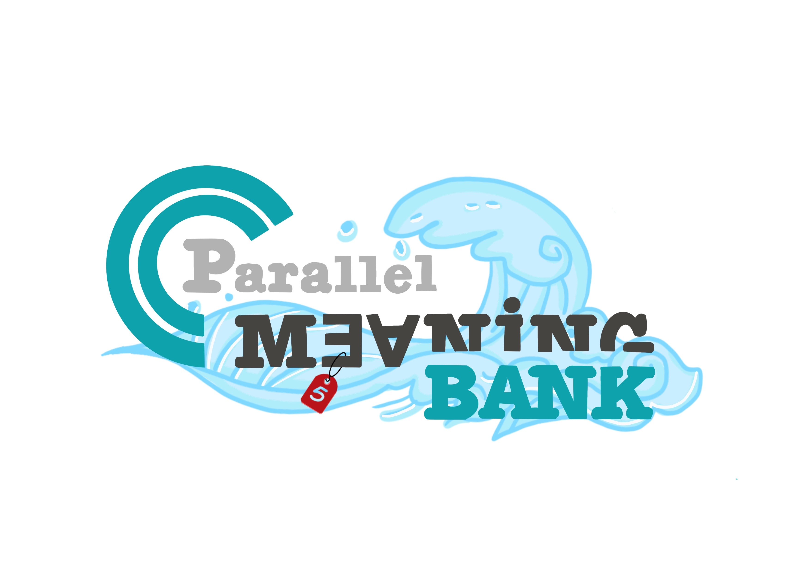
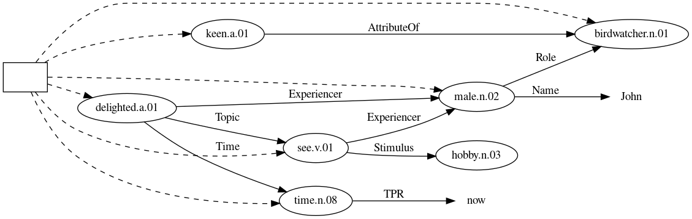
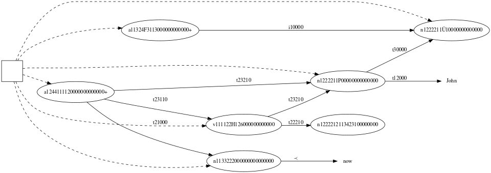

<!-- PROJECT LOGO -->
<br />
<div align="center">
  <a href="https://pmb.let.rug.nl/">
    
  </a>

  <h2 align="center">Neural Semantic Parsing with Extremely Rich Symbolic Meaning Representations</h2>

  <p align="center">
    A novel semantic representation containing more information!
    <br />
    <a href="https://arxiv.org/abs/2404.12698"><strong>Read the paper»</strong></a>
  </p>
</div>


<!-- TABLE OF CONTENTS -->
<details>
  <summary>Table of Contents</summary>
  <ol>
    <li>
      <a href="#about-the-project">About The Project</a>
    </li>
    <li>
      <a href="#getting-started">Getting Started</a>
      <ul>
        <li><a href="#Data">Data preparation</a></li>
        <li><a href="#installation">Installation</a></li>
      </ul>
    </li>
    <li><a href="#training">Training</a></li>
    <li><a href="#post-processing">Post processing</a></li>
    <li><a href="#evaluation">Evaluation</a></li>
    <li><a href="#results">Results</a></li>
    <li><a href="#probing">Probing</a></li>
    <li><a href="#license">License</a></li>
    <li><a href="#contact">Contact</a></li>
  </ol>
</details>


<!-- ABOUT THE PROJECT -->
## About The Project

This project is conduct by the Parallel Meaning Bank group --- led by Johan bos.

Discourse Meaning Representation in the style of PMB:
<a>
    
</a>


The proposed symbolic Discourse Meaning Representation in the style of PMB:
<a>
    
</a>


<p align="right">(<a href="#readme-top">back to top</a>)</p>


<!-- GETTING STARTED -->
## Getting Started

### Data

The sequential data is already available at <code>/data</code> folder. For original data, download at the website of PMB: <a href="https://pmb.let.rug.nl/data.php"> data </a>

_!!_ If you want to conduct experiments on the challenge set, please contact us.


### Installation

1. Clone the repo
   ```sh
   git clone git@github.com:LastDance500/neural-symbolic-parsing.git
   ```
   
2. Create the environment
   ```sh
   conda create -n tax_parsing
   conda activate tax_parsing
   ```

3. Install the required packages
   ```sh
   pip install -r requirements.txt
   ```
   
4. Data pre-processing
    if you want to process the data from scratch, using the following command to get the proposed semantic representation:
    ```sh
    python3 ./pre-processing/concept-tax/concept2tax.py -i ./data/seq2lps/en/train/gold.sbn -s ./data/seq2tax/en/train/gold.sbn
    python3 ./pre-processing/concept-tax/concept2tax.py -i ./data/seq2lps/en/test/standard.sbn -s ./data/seq2tax/en/test/standard.sbn
    python3 ./pre-processing/concept-tax/concept2tax.py -i ./data/seq2lps/en/dev/standard.sbn -s ./data/seq2tax/en/dev/standard.sbn
    python3 ./pre-processing/concept-id/concept2id.py -i ./data/seq2lps/en/train/gold.sbn -s ./data/seq2id/en/train/gold.sbn
    python3 ./pre-processing/concept-id/concept2id.py -i ./data/seq2lps/en/test/standard.sbn -s ./data/seq2id/en/test/standard.sbn
    python3 ./pre-processing/concept-id/concept2id.py -i ./data/seq2lps/en/dev/standard.sbn -s ./data/seq2id/en/dev/standard.sbn
    ```

<p align="right">(<a href="#readme-top">back to top</a>)</p>


<!-- USAGE EXAMPLES -->
## Training

We can train several models using the scripts in the <code> experiments </code> folder. 
To train more models, please change the name of the model in <code>model.py</code>
Here is one example to train a byT5 model

Training on standard (original graph) data:
   ```sh
   python3 experiments/model/byt5/run.py -t data/seq2lps/en/train/gold.sbn -d data/seq2lps/en/dev/standard.sbn -e data/seq2lps/en/test/standard.sbn -s experiments/results/run1/byt5/lps -epoch 50 -lr 1e-4 -c data/seq2lps/en/test/long.sbn -ms model_saves/run1/byt5/lps
   ```

Training on the proposed data:
   ```sh
   python3 experiments/model/byt5/run.py -t data/seq2tax/en/train/gold_wide.sbn -d data/seq2tax/en/dev/standard_wide.sbn -e data/seq2lps/en/test/standard.sbn -s experiments/results/run1/byt5/tax/wide -epoch 50 -lr 1e-4 -c data/seq2lps/en/test/long.sbn -ms model_saves/run1/byt5/tax/wide
   ```

<p align="right">(<a href="#readme-top">back to top</a>)</p>


<!-- Post processing -->
## post-processing

To map the taxonomical code (symbolic representation) to standard (lps representation):
   ```sh
    python3 ./post-processing/tax-concept/wide/tax2concept_by_distance.py -i ./experiments/results/run1/byt5/lps/standard/standard.sbn -o ./experiments/post_results/run1/byt5/lps/standard/standard.sbn
   ```

<p align="right">(<a href="#readme-top">back to top</a>)</p>


<!-- Evaluation -->
## Evaluation

We have two evaluation metric: hard Smatch and soft Smatch:

for hard smatch, i.e. standard smatch:

   ```sh
    python3 ./evaluation/parsing_smatch/sbn/sbn_smatch_fine_grained.py -s1 ./data/seq2lps/en/test/standard.sbn -s2 experiments/results/run1/byt5/en/lps/standard/standard.sbn
    python3 ./evaluation/parsing_smatch/sbn/sbn_smatch_fine_grained.py -s1 ./data/seq2lps/en/test/standard.sbn -s2 experiments/results/run1/byt5/en/tax/standard/standard.sbn
   ```

for soft smatch, i.e. standard smatch:

   ```sh
    python3 ./evaluation/s2match/sbn/sbn_smatch_fine_grained.py -s1 ./data/seq2lps/en/test/standard.sbn -s2 experiments/results/run1/byt5/en/lps/standard/standard.sbn
    python3 ./evaluation/s2match/sbn/sbn_smatch_fine_grained.py -s1 ./data/seq2lps/en/test/standard.sbn -s2 experiments/results/run1/byt5/en/tax/standard/standard.sbn
   ```


<!-- Results -->
## Results

In this repo, we provide the one run result for standard set, challenge set, long set for the reader's reference, which can be found in <code>experiments/results</code>

The challenge set is not public, please contact us if you want to test on it.


<!-- Probing -->
## Probing

run the probing for examples (! you need to have the trained models):

   ```sh
   python3 ./prediction/probing/prob.py
   ```

run the probing for Hierarchy Reflection Score (HRS) (! you need to have the challenge set): 

   ```sh
   python3 ./prediction/probing/prob_all_sensem.py  # you need to have the sense embeddings, check SensEmBERT
   python3 ./prediction/probing/prob_all_lps.py 
   python3 ./prediction/probing/prob_all_id.py
   python3 ./prediction/probing/prob_all_tax.py
   ```


<!-- LICENSE -->
## License

Distributed under the MIT License. See `LICENSE.txt` for more information.

<p align="right">(<a href="#readme-top">back to top</a>)</p>


<!-- CONTACT -->
## Contact

Xiao Zhang - xiao.zhang@rug.nl

Johan Bos - johan.bos@rug.nl

<p align="right">(<a href="#readme-top">back to top</a>)</p>

